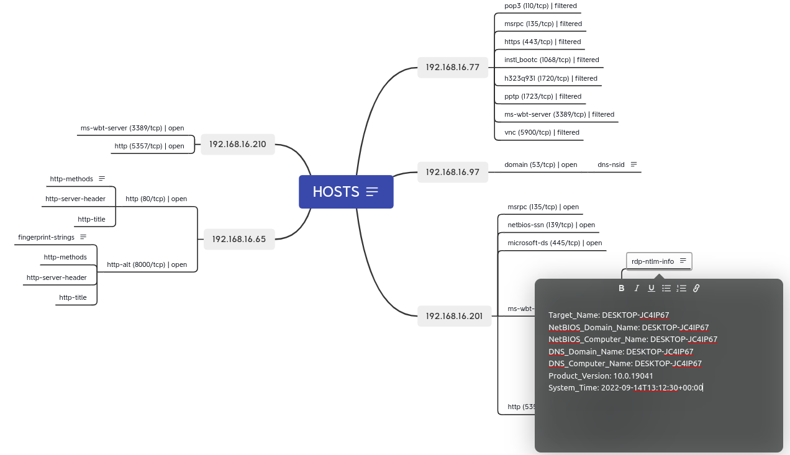

# nmap2xmind

It is a simple tool for converting Nmap XML output into Xmind mind maps. It allows security professionals and network administrators to visualize network scan data from Nmap in a structured and organized format.

The tool provides a command-line interface and can be run either locally or in a Docker container.

# Features

- Converts Nmap XML output to Xmind mind map format.
- Outputs intermediate JSON file for further processing
- Supports both local and Docker execution modes.


# Requirements

- Node.js
- Nmap 
- Docker (optional)
- Xmind (obviously to visualize)

# Usage

### Build 

- Clone the project

**Docker mode**

```bash

```bash
# Edit the variable to suit your needs in nmap2xmind.sh
EXEC_MODE="docker" # local or docker
```

```bash 
./nmap2xmind.sh --build
./nmap2xmind.sh <nmap-result.xml>
# ...
```

----

**Manual build**

```bash
cd nmap2xmind
npm install

# add it to you PATH 
ln -sv $PWD/nmap2xmind.js /user/local/bin/nmap2xmind
node nmap2xmind.js <nmap-result.xml>
```

```bash
# or via STDIN
cat <nmap-result.xml> | nmap2xmind.js
```


```bash
nmap -sCTV 192.168.1.1/24 -oX nmap-result.xml 
nmap2xmind nmap-result.xml
# Saved as nmap-result.xmind
```

- Then simply open the file with XMIND

